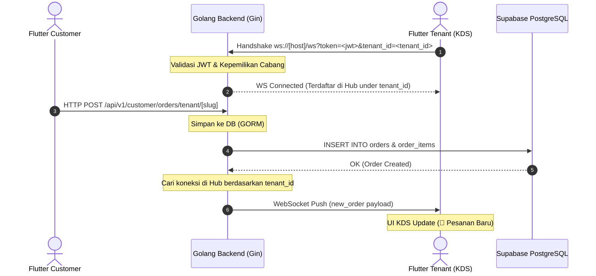

# Spesifikasi & Panduan Integrasi WebSocket Real-Time Order

Dokumen ini menjelaskan arsitektur WebSocket yang telah diimplementasikan pada backend dan cara melakukan integrasi serta penanganan di frontend menggunakan **Flutter**.

---

## 1. Gambaran Umum & Arsitektur

WebSocket ini dirancang untuk memproses notifikasi pesanan masuk secara real-time dari aplikasi Customer menuju Kitchen Display System (KDS) milik Partner (Mitra) pada cabang tenant yang sesuai.

### Diagram Alur Koneksi & Notifikasi



---

## 2. Spesifikasi Endpoint Backend

### **Endpoint URL**

```
ws://localhost:8080/ws?token=<JWT_TOKEN>&tenant_id=<TENANT_UUID>
```

### **Parameter Query**

| Parameter   | Tipe   | Wajib      | Keterangan                                                      |
| ----------- | ------ | ---------- | --------------------------------------------------------------- |
| `token`     | String | Ya         | JWT Access Token dari response login Supabase Auth.             |
| `tenant_id` | String | Ya (Mitra) | UUID cabang tenant yang saat ini sedang dibuka/dikelola di KDS. |

### **Alur Keamanan & Validasi Koneksi**

1. **Verifikasi Token**: Server memverifikasi kecocokan JWT token menggunakan `JWT_SECRET`. Jika tidak valid, koneksi ditolak (`401 Unauthorized`).
2. **Validasi Kepemilikan Cabang**: Khusus peran `PARTNER`, server melakukan query ke database PostgreSQL dengan casting tipe data UUID:
   ```sql
   SELECT count(*) FROM tenants
   WHERE id = NULLIF(tenant_id, '')::uuid
     AND user_id = NULLIF(user_id, '')::uuid
     AND deleted_at IS NULL;
   ```

   - Jika partner terbukti memiliki hak akses ke cabang tersebut (`count > 0`), koneksi didaftarkan ke hub dengan ID cabang (`tenant_id`).
   - Jika tidak cocok, koneksi langsung diputus secara sepihak untuk mencegah IDOR (menyadap cabang orang lain).

---

## 3. Format Payload Pesanan Baru (Real-Time Push)

Ketika Customer sukses melakukan checkout via REST API, backend akan mengirimkan payload JSON berikut secara realtime ke koneksi KDS cabang bersangkutan:

```json
{
  "type": "new_order",
  "order_id": "46a33c95-98ef-4f7e-90cc-991551de8d59",
  "customer_id": "ddf9f408-9f74-44da-baf8-2b559c0503a1",
  "status": "pending"
}
```

---

## 4. Panduan Integrasi Frontend (Flutter)

### **Langkah A — Instalasi Package**

Tambahkan package `web_socket_channel` pada file `pubspec.yaml`:

```yaml
dependencies:
  flutter:
    sdk: flutter
  web_socket_channel: ^3.0.1
```

Jalankan perintah `flutter pub get`.

### **Langkah B — Pembuatan Service (`websocket_service.dart`)**

Buat file `lib/core/services/websocket_service.dart` untuk membungkus fungsionalitas WebSocket secara clean:

```dart
import 'dart:convert';
import 'dart:async';
import 'package:web_socket_channel/web_socket_channel.dart';
import 'package:web_socket_channel/status.dart' as status;

class WebSocketService {
  WebSocketChannel? _channel;
  bool _isConnecting = false;

  // Callback untuk meneruskan event pesanan baru ke State Management / UI
  Function(Map<String, dynamic>)? onNewOrderReceived;

  // Menghubungkan WebSocket ke Server
  void connect({required String token, required String tenantId}) {
    if (_channel != null || _isConnecting) return;
    _isConnecting = true;

    // Gunakan ws:// untuk localhost dan wss:// untuk production HTTPS
    final String wsUrl = "ws://localhost:8080/ws?token=$token&tenant_id=$tenantId";

    try {
      _channel = WebSocketChannel.connect(Uri.parse(wsUrl));
      _isConnecting = false;
      print("🔌 WebSocket KDS Terhubung ke Cabang: $tenantId");

      // Dengarkan stream dari server
      _channel!.stream.listen(
        (rawMessage) {
          _handleIncomingMessage(rawMessage);
        },
        onError: (error) {
          print("❌ WebSocket Error: $error");
          _reconnect(token: token, tenantId: tenantId);
        },
        onDone: () {
          print("🔌 WebSocket Terputus. Mencoba menghubungkan kembali dalam 5 detik...");
          _reconnect(token: token, tenantId: tenantId);
        },
      );
    } catch (e) {
      _isConnecting = false;
      print("❌ Gagal membuat koneksi WebSocket: $e");
      _reconnect(token: token, tenantId: tenantId);
    }
  }

  // Parsing data JSON yang diterima
  void _handleIncomingMessage(dynamic rawMessage) {
    try {
      final Map<String, dynamic> data = jsonDecode(rawMessage);

      // Filter tipe event
      if (data['type'] == 'new_order') {
        if (onNewOrderReceived != null) {
          onNewOrderReceived!(data);
        }
      }
    } catch (e) {
      print("Gagal parse data WebSocket: $e");
    }
  }

  // Logika Auto-Reconnect jika koneksi terputus tiba-tiba
  void _reconnect({required String token, required String tenantId}) {
    _channel = null;
    Timer(const Duration(seconds: 5), () {
      connect(token: token, tenantId: tenantId);
    });
  }

  // Memutuskan koneksi secara bersih saat keluar/logout
  void disconnect() {
    if (_channel != null) {
      _channel!.sink.close(status.goingAway);
      _channel = null;
      print("🔌 WebSocket KDS diputus secara manual.");
    }
  }
}
```

### **Langkah C — Cara Penggunaan di Screen / State (BLoC / Provider)**

Inisialisasi koneksi saat halaman KDS dibuka dan tutup koneksi saat halaman dihancurkan:

```dart
class _KdsScreenState extends State<KdsScreen> {
  final WebSocketService _wsService = WebSocketService();

  @override
  void initState() {
    super.initState();

    // 1. Lakukan koneksi saat inisialisasi state
    _wsService.connect(
      token: userToken,       // Dapatkan token login aktif
      tenantId: activeBranch, // Cabang aktif yang sedang dikelola
    );

    // 2. Berlangganan event pesanan baru
    _wsService.onNewOrderReceived = (orderData) {
      // Pemicu suara notifikasi atau update list data order
      print("🔔 Pesanan Baru Diterima: ${orderData['order_id']}");

      // Contoh: Refresh list pesanan lewat State Management Anda
      // context.read<OrderBloc>().add(FetchOrdersEvent());
    };
  }

  @override
  void dispose() {
    // 3. Pastikan koneksi ditutup secara bersih
    _wsService.disconnect();
    super.dispose();
  }

  @override
  Widget build(BuildContext context) {
     return Scaffold(
        appBar: AppBar(title: const Text("Kitchen Display System")),
        body: const Center(child: Text("Menunggu Pesanan Real-Time...")),
     );
  }
}
```
