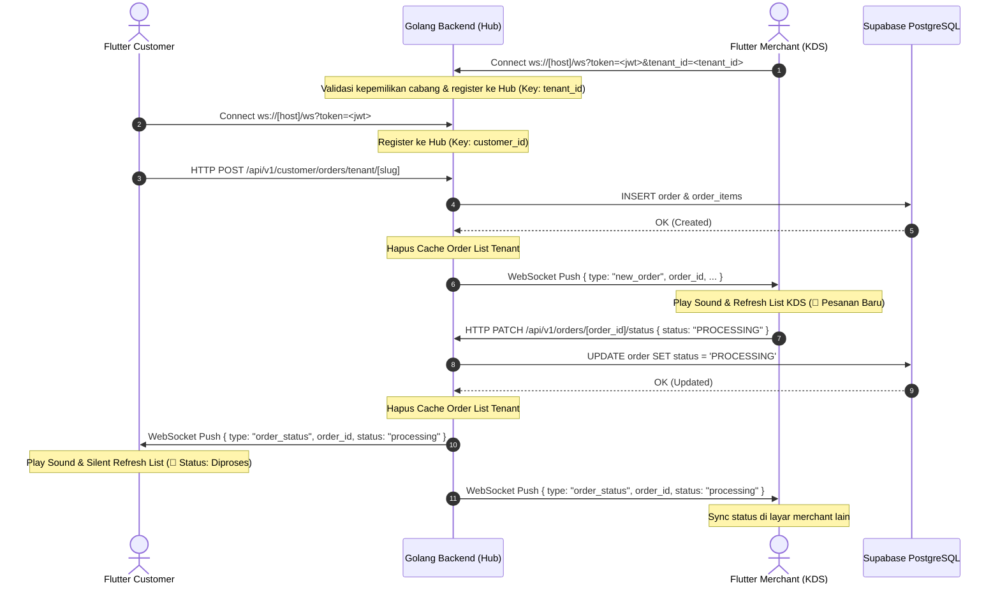

# Spesifikasi & Panduan Integrasi WebSocket Real-Time Order & Status

Dokumen ini menjelaskan arsitektur WebSocket bidirectional yang diimplementasikan pada backend Golang dan cara penanganan integrasinya di frontend **Flutter** untuk dua alur utama:
1. **Customer → Merchant (KDS)**: Notifikasi pesanan baru masuk secara real-time.
2. **Merchant → Customer**: Notifikasi perubahan status pesanan secara real-time.

---

## 1. Gambaran Umum & Arsitektur

WebSocket Hub mengelola koneksi aktif dan mendistribusikan event berdasarkan ID registrasi client (`clientID`).
- Koneksi **Merchant (KDS)** didaftarkan menggunakan **Tenant ID** (UUID Cabang).
- Koneksi **Customer** didaftarkan menggunakan **User ID** (UUID Akun Customer).

### Diagram Alur Real-Time


```mermaid
sequenceDiagram
    autonumber
    actor Customer as Flutter Customer
    participant Server as Golang Backend (Hub)
    actor Partner as Flutter Merchant (KDS)
    participant DB as Supabase PostgreSQL

    %% Koneksi Awal
    Partner->>Server: Connect ws://[host]/ws?token=<jwt>&tenant_id=<tenant_id>
    Note over Server: Validasi kepemilikan cabang & register ke Hub (Key: tenant_id)
    Customer->>Server: Connect ws://[host]/ws?token=<jwt>
    Note over Server: Register ke Hub (Key: customer_id)

    %% Alur 1: Pesanan Baru Masuk
    Customer->>Server: HTTP POST /api/v1/customer/orders/tenant/[slug]
    Server->>DB: INSERT order & order_items
    DB-->>Server: OK (Created)
    Note over Server: Hapus Cache Order List Tenant
    Server->>Partner: WebSocket Push { type: "new_order", order_id, ... }
    Note over Partner: Play Sound & Refresh List KDS (🔔 Pesanan Baru)

    %% Alur 2: Update Status Pesanan
    Partner->>Server: HTTP PATCH /api/v1/orders/[order_id]/status { status: "PROCESSING" }
    Server->>DB: UPDATE order SET status = 'PROCESSING'
    DB-->>Server: OK (Updated)
    Note over Server: Hapus Cache Order List Tenant
    Server->>Customer: WebSocket Push { type: "order_status", order_id, status: "processing" }
    Note over Customer: Play Sound & Silent Refresh List (🔔 Status: Diproses)
    Server->>Partner: WebSocket Push { type: "order_status", order_id, status: "processing" }
    Note over Partner: Sync status di layar merchant lain
```

---

## 2. Spesifikasi Endpoint & Handshake

### **Endpoint URL**
```
ws://[host]/ws?token=<JWT_TOKEN>&tenant_id=<TENANT_UUID>
```

### **Parameter Query Handshake**

| Parameter | Tipe | Wajib | Keterangan |
| :--- | :--- | :--- | :--- |
| `token` | String | Ya | JWT Access Token dari login aktif. |
| `tenant_id` | String | Opsional | UUID Cabang. Wajib dikirim oleh role `PARTNER` untuk mengarahkan notifikasi ke cabang yang benar. Untuk `CUSTOMER`, parameter ini dikosongkan. |

### **Logika Registrasi Role di Backend**
* **Customer**: Saat token diverifikasi memiliki role `CUSTOMER`, server akan mendaftarkan koneksi menggunakan `claims.Subject` (User ID Customer) sebagai `clientID` di Hub.
* **Partner**: Saat token diverifikasi memiliki role `PARTNER`, server memvalidasi kepemilikan `tenant_id` ke DB. Jika valid, koneksi didaftarkan menggunakan `tenant_id` sebagai `clientID` di Hub.

---

## 3. Format Payload (Real-Time Push)

### **A. Event: Pesanan Baru (`new_order`)**
Dikirim oleh backend ke Merchant (KDS) ketika customer selesai melakukan checkout.
```json
{
  "type": "new_order",
  "order_id": "46a33c95-98ef-4f7e-90cc-991551de8d59",
  "customer_id": "ddf9f408-9f74-44da-baf8-2b559c0503a1",
  "status": "pending"
}
```

### **B. Event: Perubahan Status (`order_status`)**
Dikirim oleh backend ke Customer (dan Merchant) ketika status pesanan diubah oleh merchant.
```json
{
  "type": "order_status",
  "order_id": "46a33c95-98ef-4f7e-90cc-991551de8d59",
  "status": "processing"
}
```

---

## 4. Mekanisme Invalidation Cache di Backend

Backend mengimplementasikan caching lokal selama 1 menit untuk query daftar pesanan guna mengurangi beban database (`GET /public/tenant/{slug}/orders`).

Agar real-time sinkronisasi berjalan sempurna:
- Setiap kali terjadi mutasi pesanan (**pembuatan**, **perubahan status**, atau **soft-delete**), backend wajib memanggil:
  ```go
  orderCache.DeleteByPrefix(fmt.Sprintf("customer:orders:tenant:%s", tenantID))
  ```
- Ini akan memaksa API client langsung mendapatkan data terbaru dari database saat terpancing event WebSocket.

---

## 5. Implementasi Flutter Service Wrapper

Gunakan file `websocket_service.dart` berikut sebagai acuan integrasi client:

```dart
import 'dart:convert';
import 'dart:async';
import 'package:web_socket_channel/web_socket_channel.dart';
import 'package:web_socket_channel/status.dart' as status;

class WebSocketService {
  WebSocketChannel? _channel;
  bool _isConnecting = false;

  // Hooks Callback
  Function(Map<String, dynamic>)? onNewOrderReceived; // Khusus Merchant
  Function(Map<String, dynamic>)? onMessageReceived;  // Generik (Customer/Merchant)

  void connect({required String token, String? tenantId}) {
    if (_channel != null || _isConnecting) return;
    _isConnecting = true;

    // Menyesuaikan parameter query untuk Customer (tanpa tenantId) dan Merchant (dengan tenantId)
    final uriStr = tenantId != null && tenantId.isNotEmpty
        ? "ws://localhost:8080/ws?token=$token&tenant_id=$tenantId"
        : "ws://localhost:8080/ws?token=$token";

    try {
      _channel = WebSocketChannel.connect(Uri.parse(uriStr));
      _isConnecting = false;
      print("🔌 WebSocket Terhubung.");

      _channel!.stream.listen(
        (rawMessage) {
          _handleIncomingMessage(rawMessage);
        },
        onError: (error) {
          print("❌ WebSocket Error: $error");
          _reconnect(token: token, tenantId: tenantId);
        },
        onDone: () {
          print("🔌 WebSocket Terputus. Menghubungkan ulang dalam 5 detik...");
          _reconnect(token: token, tenantId: tenantId);
        },
      );
    } catch (e) {
      _isConnecting = false;
      print("❌ Gagal terhubung WebSocket: $e");
      _reconnect(token: token, tenantId: tenantId);
    }
  }

  void _handleIncomingMessage(dynamic rawMessage) {
    try {
      final Map<String, dynamic> data = jsonDecode(rawMessage);

      // Trigger callback generik
      if (onMessageReceived != null) {
        onMessageReceived!(data);
      }

      // Backward compatibility untuk KDS lama
      if (data['type'] == 'new_order' && onNewOrderReceived != null) {
        onNewOrderReceived!(data);
      }
    } catch (e) {
      print("Gagal parse data WebSocket: $e");
    }
  }

  void _reconnect({required String token, String? tenantId}) {
    _channel = null;
    Timer(const Duration(seconds: 5), () {
      connect(token: token, tenantId: tenantId);
    });
  }

  void disconnect() {
    if (_channel != null) {
      _channel!.sink.close(status.goingAway);
      _channel = null;
      print("🔌 WebSocket diputus manual.");
    }
  }
}
```

---

## 6. Siklus Status Pesanan (Order Lifecycle)

Berikut adalah pemetaan status pesanan yang digunakan dalam sistem:

| Status Kode (DB) | Teks UI (Indonesia) | Warna Chip UI | Keterangan |
| :--- | :--- | :--- | :--- |
| `PENDING` | Menunggu Konfirmasi | Jingga / Orange | Pesanan baru dibuat, menunggu aksi merchant. |
| `PROCESSING` | Diproses | Biru / Primary | Merchant mulai memproses/memasak pesanan. |
| `READY` | Siap Disajikan | Teal | Makanan siap diambil pelanggan / diantar ke meja. |
| `COMPLETED` | Selesai | Hijau | Pesanan selesai disajikan/dibayar penuh. |
| `CANCELLED` | Dibatalkan | Merah | Pesanan dibatalkan oleh kasir/sistem. |
